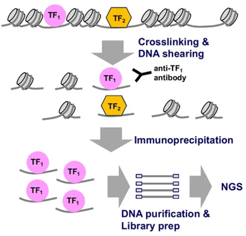

# ChIP-seq Vs CUT&RUN

## ChIP-seq

Chromatin Immunoprecipitation followed by sequencing (**ChIP-seq**) was for many years the dominant method for mapping protein-DNA interactions genome-wide. In this technique, cells are chemically cross-linked (typically with formaldehyde) to covalently lock proteins to the DNA they are bound to, the chromatin is then sheared by sonication into fragments, and an antibody against the protein of interest is used to immunoprecipitate the cross-linked protein-DNA complexes. After reversing the cross-links, the co-precipitated DNA is purified and sequenced. By identifying where the recovered DNA maps in the genome, the binding sites of the target protein can be inferred.

 

  
  
   
  <em>Representation of the ChIP-seq method. Adapted from Hojo & Ohba, Current Osteoporosis Reports (2023), used under CC BY 4.0 (https://creativecommons.org/licenses/by/4.0/deed.en)</em> 

 

## ChIP-seq Limitations and CUT&RUN as an Alternative

ChIP-seq became the gold standard for studying transcription factor binding, histone modifications, and chromatin-associated proteins because it was the first method to provide genome-wide resolution of these interactions at reasonable cost and scale. However, the technique carries several limitations that affect both data quality and experimental feasibility:

- **Cross-linking** in particular introduces a category of artifacts that are difficult to fully control: formaldehyde can fix proteins that are near the DNA without directly binding it, creating false-positive signal, and the efficiency of cross-linking and reversal varies between cell types, treatments, and chromatin states.
- **Sonication** while effective at fragmenting chromatin, is inherently stochastic and introduces sequence-dependent bias that can skew coverage.

Together, these factors mean that ChIP-seq data requires significant sequencing depth and careful normalization to distinguish true signal from noise.

CUT&RUN was developed specifically to address these limitations. By tethering MNase to an antibody-bound protein and cleaving DNA *in situ*, without fixation or bulk chromatin extraction, it produces a much cleaner signal with far less input material and sequencing depth.

 

  
  | Parameter | ChIP-seq | CUT&RUN |
  | :--- | :--- | :--- |
  | **Cell input** | Typically 1–20 million cells | As few as 100–1,000 cells |
  | **Cross-linking** | Required (formaldehyde); introduces artifacts | Not required; native chromatin context preserved |
  | **Background noise** | High; requires deep sequencing to overcome | Very low; high signal-to-noise by design |
  | **Resolution** | Limited by sonication fragment size (~200–500 bp) | High; MNase cleavage occurs at the exact binding site |
  | **Antibody requirements** | Must work under denaturing/cross-linked conditions | Must work on native, unfixed protein |
  | **Protocol duration** | 2–3 days minimum | Can be completed in 1 day |
  | **Sequencing depth required** | High (20–40M reads typical) | Low (3–10M reads often sufficient) |
  | **Artifacts** | Sonication bias, cross-linking noise, antibody pull-down non-specificity | Over-digestion, antibody incompatibility with native epitopes |

 

For these reasons, this repository focuses on CUT&RUN as the method of choice for protein-DNA interaction mapping. ChIP-seq remains widely used, particularly in large-scale projects and settings where existing validated antibodies and pipelines are already established.

The downstream computational analysis (more detail on this can be found inside the [CUT&RUN analysis](./03_CUT&RUN_analysis.md) section of this work) overlaps substantially between the two techniques: annotation with ChIPseeker and motif enrichment with HOMER or MEME are directly applicable to ChIP-seq data. However, the peak calling strategy diverges: ChIP-seq, like ATAC-seq, relies on MACS3, which is designed to model the relatively high and variable background produced by sonication and immunoprecipitation. CUT&RUN's exceptionally low background makes it better suited to SEACR for transcription factor targets, where its threshold-based approach takes advantage of the clean signal-to-noise ratio that ChIP-seq cannot reliably achieve. MACS3 remains the preferred option for broader histone mark targets in CUT&RUN, where peak profiles more closely resemble those seen in ChIP-seq data.

