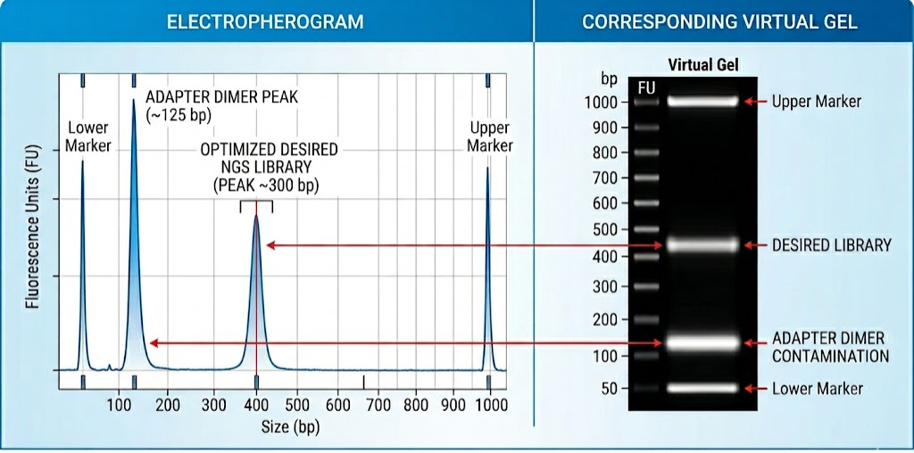
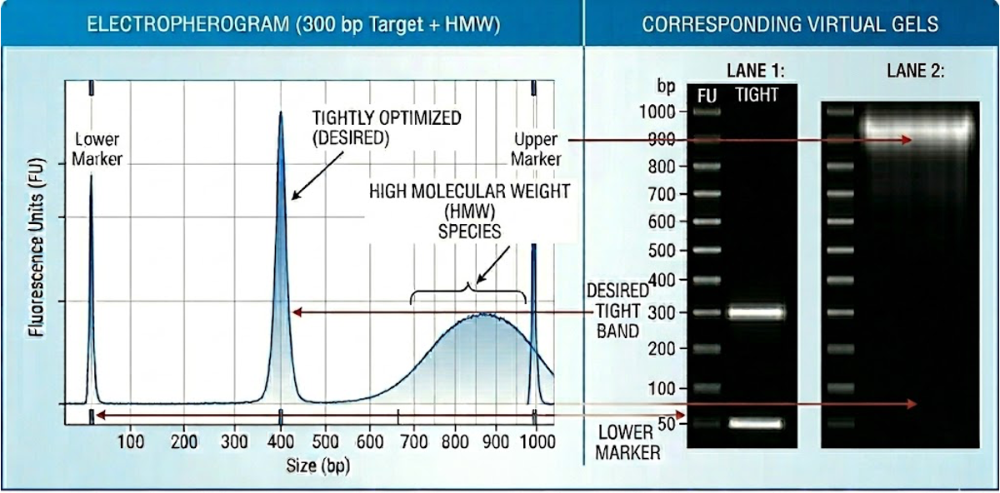

# Fragment Size Distribution

Fragment size distribution analysis provides a readout of the size composition of sequencing libraries prior to sequencing. It is an essential quality control step in library preparation, as it reflects both the efficiency of fragmentation and size selection, as well as the presence of unwanted by-products such as adapter dimers or high molecular weight contaminants.

Unlike the sequencing-based QC metrics covered in the next section, fragment size profiles are not derived from sequencing reads, but from physical separation of DNA molecules using microfluidic electrophoresis systems. For this reason, they represent a direct measurement of library structure before sequencing.

This section describes interpretation of fragment size distributions and their most common deviations prior to sequencing.

## Presence of a Prominent, Short Fragment Peak

A strong, sharp peak in the ~120–150 bp range is typically indicative of an overrepresentation of short library species. In most sequencing libraries, this population corresponds to adapter-ligated short fragments rather than true biological signal.

- **Adapter dimers:** An excess or an incorrect ratio with gDNA of the adapters used in the library preparation, can lead to their dimerization, creating a characteristic sharp peak of low molecular weight on the TapeStation profile. To avoid this, the final concentration of each primer should be between 0.2-0.5 µM, but it's essential to take into account the primer-to-template ratio: if there is too much primer relative to very few DNA fragments, the primers are more likely to find each other (dimerization) than they are to find a rare DNA template, while it needs to be ensured that the reaction doesn't reach primer starvation before the desired library concentration is achieved.
The presence of adapter dimers can also be a consequence of a too permissive SPRI clean-up step. In this cases, a further 0.6x or 0.8x (e.g., 40µL beads to 50µL DNA) AMPure bead cleanup is recommended.
- **Inefficient removal of smaller fragments:** If the fragment size selection strategy fails to remove smaller, non-biologically relevant fragments, or if the PCR amplification step of the library prep is biased towards small molecules, these will also contribute to the formation of a smaller fragment size peak, likely widening the one originated by the adapter dimer's one. In this case, both the SPRI and PCR conditions should be reviewed.
- **Enzymatic activity:** In enzyme-based chromatin assays (ATAC-seq, CUT&RUN), this pattern may also reflect excessive enzymatic activity relative to available accessible chromatin, resulting in a shift toward minimal fragment products.
- **Primer dimers:** In protocols that require PCR amplification, the primers used in this step can dimerize and generate a small fragment size peak, of lower molecular weight than adapter primers (~20-30 bp). To prevent this, the primer concentration added into the mix, and its ratio to the gDNA to be amplified need to be carefully considered. Additionally, it is advisable to use a hot-start polymerase (see above), and sometimes to increase the annealing temperature 2 °C with problematic libraries to increase stringency.  

 

  
   
  <em>TapeStation profile showing a typical case of a library containing adapter primer contamination.</em>

 

## Broad or Smeared Fragment Size Distribution

A wide, smeared distribution centered at the target size is problematic because it causes size-biased stochastic clustering, where shorter fragments may preferentially cluster due to higher molar representation and more efficient amplification and cluster formation.

- **DNA/RNA degradation:** Poor sample handling before and during library prep can lead to genome degradation, leading to a very wide peak that sometimes fuses with the adapter dimer peak, and the virtual gel shows a smeary signal.
- **Over-fragmentation or excessive enzymatic digestion:** ' conditions in case of mechanical fragmentation, and enzyme concentration, and digestion time, in assays in which fragmentation is dependent on enzymatic activity, should be tightly controlled.
- **Suboptimal size selection conditions:** Using too permissive SPRI ratios lead to a less stringent size selection and therefore to wider or smeared distributions.
- **Excessive PCR cycling:** Overamplification introduces strong size- and sequence-dependent bias during library enrichment. Shorter fragments amplify more efficiently and progressively dominate the library as PCR approaches plateau, while longer fragments become underrepresented. This leads to a loss of definition in the original fragment distribution, resulting in a flattened or smeared electropherogram where distinct size populations (e.g., nucleosomal peaks in chromatin assays) become indistinguishable.
- **Sample heterogeneity or incomplete lysis:** In chromatin-based assays, incomplete nuclei isolation or variable cell lysis leads to uneven enzymatic access across the sample population. Some nuclei remain partially inaccessible to transposase or MNase activity, while others are fully exposed. This produces a mixed fragmentation landscape in which over-digested and under-digested populations coexist, resulting in a broad, incoherent size distribution with reduced or absent structured peak patterns. In highly heterogeneous samples, differences in chromatin state between cell types further exacerbate this effect.

 

  
   
  <em>TapeStation profile showing a typical case of a library with an overly broad fragment size distribution.</em>

 

## High Molecular Weight Peak or Tail

HMW contamination reduces effective sequencing efficiency by shifting library mass away from the intended fragment range.

- **Under-fragmentation or insufficient enzymatic digestion:** Suboptimal sonication conditions, or enzymatic digestion conditions can lead to the presence of intact genomic DNA contamination.
- **Inefficient transposase or nuclease access in chromatin assays:** Overly closed chromatin states due to treatment or cell type choice can make enzyme access difficult and reduce fragmentation efficiency, leading to HMW species dominating the signal.

 

  
   
  <em>TapeStation profile showing a library containing high molecular weight species.</em>

 

## Loss of expected intermediate fragment populations

As seen in their respective library preparation sections, the expected fragment size distribution is assay-dependent, and it is a good measure of the library quality. While RNA-seq typically shows a relatively tight unimodal distribution around the selected fragment size, a ladder-like distribution is indicative of a good quality library in ATAC-seq. In the case of CUT&RUN, the number and size of the detected peaks depends on the binding activity of the protein of interest (transcription factor/histone binding factor).

In assays where structured fragment distributions are expected, the absence or weakening of intermediate peaks may indicate disruption of biological signal. Potential causes include:

- **Over-aggressive size selection removing informative fragments:** Because the range of biologically relevant fragment sizes is bigger in ATAC-seq (and also in CUT&RUN if the protein of interest acts both as a TF and a histone binder), a tightly controlled SPRI clean-up step is required. More details on such conditions are included in the library preparation sections of [CUT&RUN](../04_Epigenomics/02_CUT&RUN_sample_prep.md) and [ATAC-seq](../04_Epigenomics/04_ATAC-seq_sample_prep.md).
- **Excessive enzymatic digestion:** Poorly controlled incubation with Tn5 or MNase can lead to excessive degradation and loss of valuable, informative fragments.
- **Low cell input:** Using an insufficient number of cells can lead to poor representation of chromatin states.

Correct interpretation of fragment size distributions therefore requires integrating both assay-specific expectations and general library construction principles.
