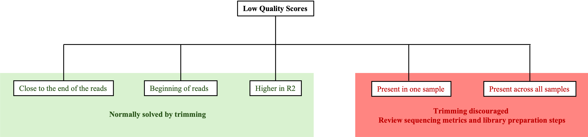
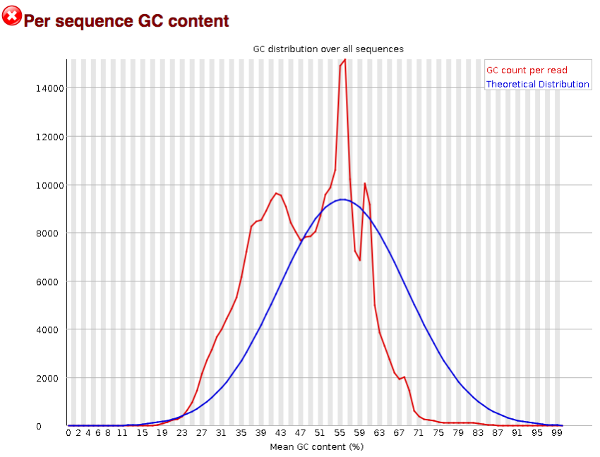

# Sequencing Run & Quality Issues

This section covers issues detected immediately after FASTQ file generation, during primary quality assessment.

**Note:** Before FASTQ file generation, the sequencer performs a **primary analysis** of the data generated during the run, providing **.interop** format files. These files can be inspected using vendor-specific tools, allowing for detailed diagnosis of sequencing instrument failures (e.g., cluster generation, fluidics, or imaging issues). Such metrics are outside the scope of this repository and therefore won't be covered here.

## Low Quality Scores

The first step when assessing the quality of the FASTQ files is looking at the Phred scores. Ideally, all samples should have a similar per sequence quality score, and a stable per base sequence quality throughout the reads.

A **low per base sequence quality in one of the samples** is usually a sign of poor sample/library preparation. However, if this issue is present **across all samples**, a sequencing/run-level issue cannot be discarded and the primary analysis performed by the sequencer needs to be checked. In these cases, because there is a widespread below-threshold Q-score, aggressive trimming will not solve the issue and it is therefore heavily discouraged. If the sequencer shows no sign of failure during the sequencing process, revision of the sample and library preparation, followed by a small pilot experiment to test if the changes made to the protocol solved the issue, is usually recommended.

However, it is important to note that some changes in the quality of specific segments of the reads are normal and should not be misinterpreted as failures:

- **The Q scores are usually lower closer to the end of the reads**, due mainly to the accumulation of phasing and pre-phasing events (the longer the read, the higher the possibility of a phasing event to occur). Other factors, such as reagent depletion over cycles or fluorophore signal decay might also contribute to this drop in quality.
- **In RNA-seq experiments, lower Phred scores at the beginning of reads** can arise from random hexamer priming during reverse transcription. Because Illumina base calling depends on sequence diversity across clusters, reduced diversity in early cycles decreases base-calling confidence and leads to lower Q-scores.

These issues are typically addressed through trimming and should not, on their own, pose a problem for downstream processing.

Additionally, in paired-end sequencing, **R2 reads often show lower overall quality than R1**, especially toward the end of the reads. This is mainly due to increased accumulation of phasing/pre-phasing events and signal decay over additional sequencing cycles. Consequently, R2 reads usually require heavier trimming than R1. Nevertheless, if the differences are very large, there could be library quality or run issues that need to be investigated.

  
   
  <em>Schematic showing different low Q scores scenarios and their implications.</em>

## Contamination and Sequence Composition Artifacts

The GC distribution shown in the per sequence GC content metric of FastQC is expected to:

- Show a smooth, bell-shaped curve (approximately normal).
- This curve must match the expected GC content in the studied organism.

The presence of **multiple peaks or a clear deviation from the expected organism's GC profile** is indicative of contamination with foreign DNA, either from the sample itself or introduced during library preparation. [FastQ Screen](https://www.bioinformatics.babraham.ac.uk/projects/fastq_screen/) or a k-mer-based tool like [Kraken2](https://github.com/DerrickWood/kraken2) can be used to quantify reads mapping to non-target genomes. A decision must then be made on whether the level of contamination is acceptable, potentially discarding samples if it is too high. The threshold for such acceptable level of contamination depends on the application and its sensitivity to non-target reads: low levels may be tolerable in exploratory analyses, while even minor contamination can compromise high-resolution tasks such as variant calling. Importantly, if the level of contamination is considered acceptable, reads mapping to non-target genomes can be filtered out to prevent interference in downstream analysis, when appropriate.

 

  
   
  <em>Per sequence GC content plot showing contamination with foreign DNA. Adapted from Quality control: Assessing FASTQC results (https://hbctraining.github.io/Intro-to-rnaseq-fasrc-salmon-flipped/lessons/07_qc_fastqc_assessment.html) under CC-BY 4.0 (https://creativecommons.org/licenses/by/4.0/deed.en).</em>

 

An **imbalance in A/T vs G/C content across read positions** can also be a red flag, although this may reflect either technical bias or true biological signal. This can be observed in the per base sequence content plot when the lines corresponding to each nucleotide are not relatively flat.

Some patterns are expected and usually do not require intervention:

- **Wavy patterns at the 5’ end** are common in RNA-seq due to random hexamer priming or residual primer/adapter sequence.
- **Increased A/T content in ATAC-seq** can reflect Tn5 insertion bias.
- **Increased G/C content** may be expected in promoter-enriched assays.
  
More concerning patterns include:

- **Smooth, consistent A/T enrichment across samples**, suggestive of PCR or fragmentation bias during library preparation.
- **Strong position-specific anomalies** caused by residual adapter or primer sequences or low library diversity. Trimming may remove technical sequences, but low-diversity libraries will still show poor mapping quality even after trimming.

| Issue | Expected? | Likely cause | Action |
| :--- | :--- | :--- | :--- |
| **Multiple peaks/unexpected GC content** | No | Contamination with foreign DNA | Run FastQ screen/Kraken2 and assess viability |
| **Imbalance in A/T vs G/C** | Situational | Technical bias/true biological signal | Evaluate in the context of the assay |
| **Consistent enrichment of A/T over G/C composition** | No | Library prep issues | Re-evaluate library prep steps and PCR settings |
| **Position-specific anomalies** | No | Residual adapters/primers or low library diversity | Trimming and reassessing |

## Adapter Contamination

Adapter contamination occurs when sequencing reads extend beyond the DNA insert and into adapter sequences, typically due to short fragment sizes or insufficient size selection during library preparation.

Adapter contamination is typically reported in the FastQC modules "Overrepresented Sequences" and "Adapter Content", and it leads to a sharp drop in quality and sudden changes in composition toward the 3’ end of reads. It can also manifest as reduced mapping rates despite otherwise good overall read quality.

**If adapter signal is primarily limited to read ends**, trimming with fastp or cutadapt is typically sufficient, followed by a new FastQC run to confirm removal. However, if a **large fraction of reads is affected or read length is substantially reduced after trimming**, this indicates a library preparation issue and both the fragment size (insert size vs read length) and size selection conditions (e.g., SPRI bead ratios) should be reviewed.

Importantly, while trimming removes adapter sequences, it does not recover lost insert sequences. If a significant proportion of reads becomes too short after trimming, downstream analyses (e.g., alignment, quantification) may still be compromised.

## Additional QC Signals

These metrics help identify technical issues that are not captured by overall quality scores or composition plots, but can still significantly affect downstream analysis.

### Per Base N Content

The per base N content of the reads should stay close to 0, with a small increase toward the 3' end in some samples. A **globally high N content** is usually due to low signal intensity during specific sequencing cycles, which can be verified in run-level sequencing metrics. A per base N content above 1% is generally considered problematic for downstream analysis.

### Sequence Length Distribution

Most sequenced fragments should ideally be of the same size, visualized as a sharp peak at the intended size in this metric. If this is not the case in one or several samples, it is likely due to an issue during library preparation for those samples. When all samples show **a consistent peak that does not match the expected size**, then the fragment size distribution (read length vs insert size) and the size selection conditions should be reviewed. Importantly, excessive trimming can also alter the sequence length distribution, so it is critical to compare this metric between pre- and post-trimming FastQC runs.

Additionally, adapter contamination (see above) may introduce an **additional peak** in the sequence length distribution plot.

| Issue | Likely cause | Action |
| :--- | :--- | :--- |
| **High per base N content** | Low signal intensity | Review sequencing metrics |
| **Fragment size different than expected** | Wrong fragment size distribution or size selection parameters | Review both |
| **Extra peak in the fragment size plot** | Adapter contamination | Trim and re-run fastQC |

### Duplication Levels

The proportion of duplicate reads should be interpreted in the context of the sequencing strategy and library type, rather than treated as an absolute quality metric (see the [post-alignment processing](../02_Mapping_&_Alignment/03_post-alignment_processing.md) section of this document for more details on this).

**High duplication rates** can arise from PCR overamplification or low-input libraries, both of which reduce library complexity and increase the likelihood that the same original fragments are sequenced multiple times. When high duplication is accompanied by a strong reduction in unique reads, effective sequencing depth is reduced and additional sequencing will yield diminishing returns unless the underlying library complexity issues are addressed first. That said, elevated duplication is not always a technical problem. In RNA-seq, highly expressed genes naturally generate large numbers of identical fragments, and in CUT&RUN, strong enrichment at specific loci can produce locally high duplication levels that reflect genuine biological signal rather than amplification bias.

**Low duplication rates** are generally expected in high-complexity libraries with sufficient input material. Unusually low duplication in techniques such as RNA-seq or CUT&RUN may instead reflect over-fragmentation or insufficient sequencing depth.

When **duplication is uneven across samples** within the same experiment, this suggests variability in library preparation quality or input material, and those samples should be interpreted with caution in downstream quantitative analyses.

In practice, duplication rates are most informative when interpreted alongside library complexity and sequencing depth. A library showing high duplication but a still-increasing number of unique fragments is likely depth-limited and would benefit from additional sequencing. One that quickly plateaus in unique fragment discovery despite greater depth is amplification-limited, and protocol optimization is required rather than simply sequencing deeper.

